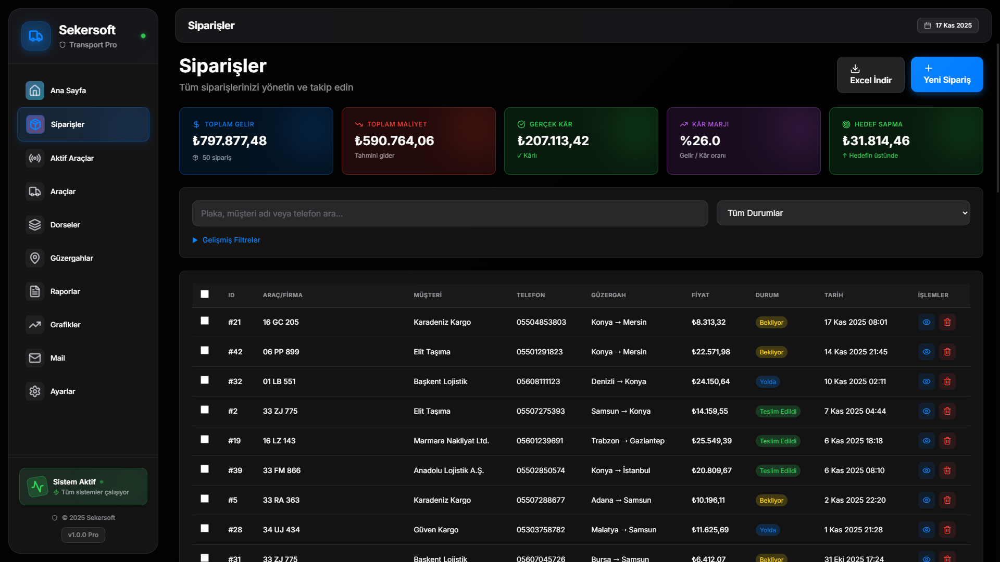
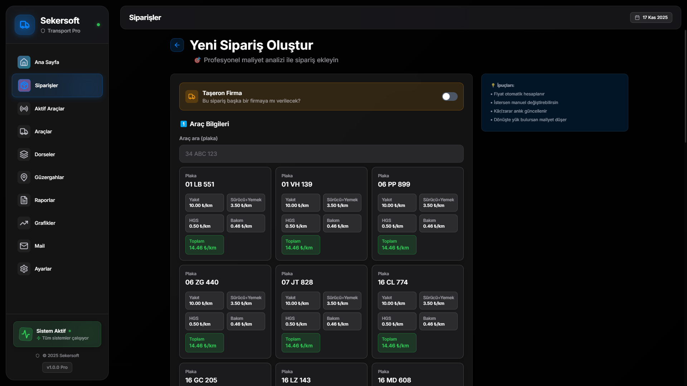
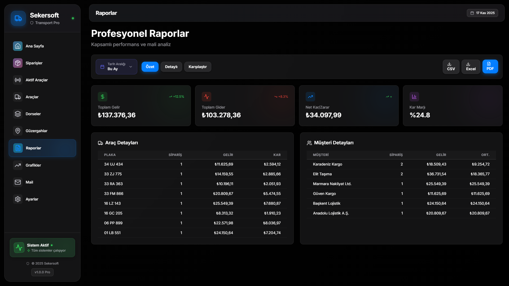
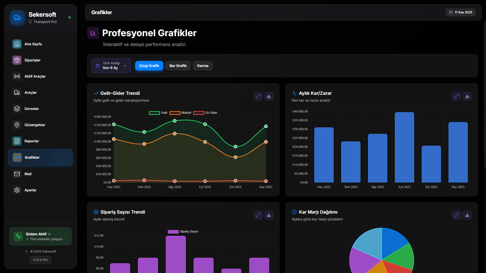

<div align="center">

# 🚚 Sekersoft - Taşımacılık Yönetim Sistemi

**Modern, offline-first masaüstü taşımacılık yönetim uygulaması**

[](https://github.com/meertseker/logistic-comp-order-tracking-system/actions/workflows/build-macos.yml)
[](https://github.com/meertseker/logistic-comp-order-tracking-system/actions/workflows/build-windows.yml)
[](https://github.com/meertseker/logistic-comp-order-tracking-system/actions/workflows/code-quality.yml)
[](https://github.com/meertseker/logistic-comp-order-tracking-system/actions/workflows/release-build.yml)

[](https://opensource.org/licenses/MIT)
[](https://github.com/meertseker/logistic-comp-order-tracking-system/releases)
[](https://github.com/meertseker/logistic-comp-order-tracking-system/issues)
[](https://github.com/meertseker/logistic-comp-order-tracking-system/pulls)
[](https://github.com/meertseker/logistic-comp-order-tracking-system/graphs/contributors)
[](https://github.com/meertseker/logistic-comp-order-tracking-system/commits/main)

[](https://www.typescriptlang.org/)
[](https://reactjs.org/)
[](https://www.electronjs.org/)
[](https://www.sqlite.org/)
[](https://vitejs.dev/)
[](https://tailwindcss.com/)

[](https://github.com/meertseker/logistic-comp-order-tracking-system/releases)
[](https://github.com/meertseker/logistic-comp-order-tracking-system/releases)
[](https://github.com/meertseker/logistic-comp-order-tracking-system/releases)

[📥 İndir](https://github.com/meertseker/logistic-comp-order-tracking-system/releases) • 
[📚 Dökümanlar](docs/INDEX.md) • 
[🐛 Bug Bildir](https://github.com/meertseker/logistic-comp-order-tracking-system/issues/new?template=bug_report.yml) • 
[✨ Özellik İste](https://github.com/meertseker/logistic-comp-order-tracking-system/issues/new?template=feature_request.yml) • 
[💬 Discussions](https://github.com/meertseker/logistic-comp-order-tracking-system/discussions)

---

</div>

Windows ve macOS'ta çalışmak üzere **Electron, React, TypeScript ve SQLite** ile geliştirilmiş, tamamen **offline** çalışan profesyonel taşımacılık yönetim sistemi.

## 📸 Ekran Görüntüleri

<details>
<summary><b>🎯 Dashboard</b> - Genel bakış ve istatistikler</summary>

<br>


</details>

<details>
<summary><b>📋 Sipariş Yönetimi</b> - Sipariş listesi ve filtreleme</summary>

<br>



</details>

<details>
<summary><b>➕ Yeni Sipariş</b> - Sipariş oluşturma formu</summary>

<br>



</details>

<details>
<summary><b>📊 Raporlama</b> - Detaylı finansal raporlar</summary>

<br>



</details>

<details>
<summary><b>📈 Grafikler</b> - Görsel analizler</summary>

<br>



</details>

Daha fazla ekran görüntüsü için [screenshots/](screenshots/) klasörüne bakınız.

---

## 🚀 Özellikler

### 🔄 Otomatik Güncelleme
- Yeni sürümler için otomatik kontrol
- Tek tıkla güncelleme
- Arka planda indirme
- Güvenli kurulum
- GitHub Releases entegrasyonu

### ✅ Sipariş Yönetimi
- Yeni sipariş oluşturma (plaka, müşteri, telefon, güzergah, yük açıklaması, fiyat)
- Sipariş detaylarını görüntüleme ve düzenleme
- Sipariş durumu takibi (Bekliyor, Yolda, Teslim Edildi, Faturalandı, İptal)
- Gelişmiş arama ve filtreleme
- WhatsApp entegrasyonu ile anında bildirim

### 💰 Gider Takibi
- Sipariş bazlı gider ekleme (Yakıt, HGS, Köprü, Yemek, Bakım, Diğer)
- Otomatik toplam hesaplama
- Gider geçmişi
- Net kazanç analizi

### 📄 Fatura Yönetimi
- PDF ve fotoğraf formatında fatura yükleme
- Sipariş bazlı fatura listeleme
- Güvenli dosya saklama

### 📊 Raporlama
- Aylık kazanç, masraf ve net gelir raporları
- En çok çalışan araçlar analizi
- En çok sipariş veren müşteriler
- Sipariş durumu dağılımı
- CSV export özelliği

### 🎯 Dashboard
- Genel bakış istatistikleri
- Aktif ve tamamlanan sipariş sayıları
- Aylık finansal özet
- Son siparişler listesi

## 🛠️ Teknoloji Stack

| Teknoloji | Versiyon | Amaç |
|-----------|----------|------|
| Electron | ^33.0.0 | Masaüstü uygulama runtime |
| React | ^19.0.0 | Kullanıcı arayüzü |
| Vite | ^5.4.0 | Build tool ve dev server |
| TypeScript | ^5.5.0 | Tip güvenliği |
| better-sqlite3 | ^12.0.0 | Yerel veritabanı |
| Tailwind CSS | ^3.4.0 | Styling |
| React Router | ^6.27.0 | Navigasyon |
| date-fns | ^4.1.0 | Tarih işlemleri |

## 📋 Gereksinimler

### Geliştirme
- **Node.js**: 18.x veya üzeri
- **npm**: 9.x veya üzeri

### Çalışma Ortamı
- **Windows**: Windows 10/11 (64-bit)
- **macOS**: 10.15 (Catalina) veya üzeri
  - Intel Macs (x64)
  - Apple Silicon Macs (M1/M2/M3)

## 🚀 Kurulum

### 1. Bağımlılıkları Yükleyin

```bash
npm install
```

### 2. Native Modülleri Rebuild Edin

```bash
npm run rebuild
```

## 🎮 Kullanım

### Geliştirme Modu

```bash
npm run electron:dev
```

Bu komut hem Vite dev server'ı hem de Electron uygulamasını başlatır.

### Production Build

#### macOS
```bash
npm run build:mac
```

Bu komut `release` klasöründe Mac için `.dmg` installer oluşturur (hem Intel hem Apple Silicon).

#### Windows
```bash
npm run build:win-installer
```

Bu komut `release` klasöründe Windows için `.exe` installer oluşturur.

### CI/CD (Otomatik Build)

Projede GitHub Actions kullanarak otomatik build sistemi kurulmuştur:

- **Windows**: Her push'ta otomatik .exe installer oluşturulur
- **macOS**: Her push'ta otomatik .dmg oluşturulur (Intel + Apple Silicon)
- **Tüm Platformlar**: Tek workflow ile her ikisi birden
- **Release Build**: Tag (v1.0.0 gibi) ile Windows + macOS
- **Artifact Storage**: Built dosyalar Actions sekmesinden indirilebilir (30-90 gün)

**Detaylı Dokümantasyon:**
- [Windows CI Build (Türkçe)](docs/setup/WINDOWS_CI_BUILD_TR.md)
- [macOS CI Build](docs/setup/MACOS_CI_BUILD.md)
- [Workflow Dokümantasyonu](.github/README.md)

### Sadece Vite Build

```bash
npm run build
```

## 📁 Proje Yapısı

```
seymentransport/
├── electron/                 # Electron ana süreç dosyaları
│   ├── main/
│   │   ├── index.ts         # Ana Electron dosyası
│   │   └── database.ts      # SQLite veritabanı yönetimi
│   └── preload/
│       └── index.ts         # Preload scripti (IPC köprüsü)
├── src/                      # React uygulaması
│   ├── components/          # Yeniden kullanılabilir componentler
│   ├── pages/               # Sayfa componentleri
│   ├── utils/               # Yardımcı fonksiyonlar
│   ├── types/               # TypeScript tip tanımları
│   ├── App.tsx              # Ana uygulama componenti
│   ├── main.tsx             # React giriş noktası
│   └── index.css            # Global stiller
├── package.json             # Proje bağımlılıkları ve scriptler
├── vite.config.ts           # Vite yapılandırması
├── tsconfig.json            # TypeScript yapılandırması
└── tailwind.config.js       # Tailwind CSS yapılandırması
```

## 💾 Veritabanı

Uygulama SQLite kullanarak tamamen offline çalışır. Veritabanı dosyası kullanıcı data klasöründe saklanır:

```
~/Library/Application Support/seymen-transport/transport.db
```

### Tablolar

1. **orders** - Sipariş bilgileri
2. **expenses** - Gider kayıtları
3. **invoices** - Fatura dosya referansları

## 🎨 Kullanıcı Arayüzü

- Modern, responsive tasarım
- Koyu/açık tema desteği için hazır altyapı
- Türkçe dil desteği
- Kullanıcı dostu form validasyonları
- Canlı veri güncellemeleri

## 🔒 Güvenlik

- Context isolation enabled
- Node integration disabled in renderer
- Safe IPC communication via preload script
- File system access sadece izin verilen işlemler için

## 📦 Paketleme

Uygulama electron-builder kullanılarak paketlenir:

```json
{
  "appId": "com.seymen.transport",
  "productName": "Sekersoft",
  "mac": {
    "target": ["dmg"],
    "category": "public.app-category.business"
  }
}
```

## 🐛 Troubleshooting

### SQLite Build Hataları

```bash
npm run rebuild
```

### Port Zaten Kullanımda

Vite dev server varsayılan olarak 5173 portunu kullanır. Değiştirmek için `vite.config.ts` dosyasını düzenleyin.

### Electron Açılmıyor

1. Node modüllerini temizleyin: `rm -rf node_modules`
2. Yeniden yükleyin: `npm install`
3. Rebuild edin: `npm run rebuild`

## 🔄 Otomatik Güncelleme Sistemi

Sekersoft, **electron-updater** kullanarak otomatik güncelleme desteğine sahiptir.

### Nasıl Çalışır?

1. **Otomatik Kontrol**: Uygulama her açıldığında yeni sürüm kontrolü yapar
2. **Bildirim**: Yeni versiyon varsa ekranın sağ üst köşesinde bildirim gösterilir
3. **İndirme**: Kullanıcı onayı ile arka planda indirilir
4. **Kurulum**: Uygulama kapanırken veya anında kurulum yapılabilir

### Güncelleme Yönetimi

Yeni bir sürüm yayınlamak için:

```bash
# Versiyon güncelle
npm version patch  # 1.0.0 → 1.0.1 (bug fix)
npm version minor  # 1.0.0 → 1.1.0 (yeni özellik)
npm version major  # 1.0.0 → 2.0.0 (breaking change)

# Git tag oluştur ve push et
git add .
git commit -m "Release v1.0.1"
git tag v1.0.1
git push origin main
git push origin v1.0.1
```

GitHub Actions otomatik olarak:
- ✅ Windows ve macOS için build yapar
- ✅ GitHub Release oluşturur
- ✅ Güncelleme dosyalarını yükler
- ✅ Kullanıcılar otomatik bildirim alır

**Detaylı bilgi**: [docs/AUTO_UPDATE.md](docs/AUTO_UPDATE.md)

## 🟢 WhatsApp Entegrasyonu

Sekersoft, **WhatsApp Business API** kullanarak otomatik bildirim gönderebilir.

### Nasıl Çalışır?

1. **Otomatik Bildirimler**: Sipariş durumu değiştiğinde müşteriye otomatik WhatsApp mesajı
2. **Manuel Gönderim**: Sipariş detay sayfasından tek tıkla WhatsApp gönder
3. **Toplu Gönderim**: Birden fazla müşteriye aynı anda mesaj gönder
4. **Mesaj Geçmişi**: Tüm gönderilen mesajların kaydı ve takibi

### Desteklenen Servisler

- **İletimerkezi** (Önerilen) - Türk servisi, kolay kurulum
- **NetGSM** - SMS + WhatsApp kombine
- **Twilio** - Global servis provider

### WhatsApp Kurulumu

```bash
# 1. Ayarlar → WhatsApp Ayarları
# 2. Servis seç (İletimerkezi öneriliyor)
# 3. API bilgilerini gir
# 4. Otomatik bildirimleri aktifleştir
# 5. Test mesajı gönder
```

### Özellikler

- ✅ Otomatik durum bildirimleri
- ✅ Sipariş oluşturulduğunda bildirim
- ✅ "Yolda" durumunda bildirim
- ✅ "Teslim Edildi" durumunda bildirim
- ✅ "Faturalandı" durumunda bildirim
- ✅ Manuel mesaj gönderimi
- ✅ Toplu mesaj gönderimi
- ✅ Mesaj şablonları
- ✅ Mesaj geçmişi ve takibi
- ✅ Yeniden gönder özelliği

**Detaylı bilgi**: [docs/features/WHATSAPP_SYSTEM.md](docs/features/WHATSAPP_SYSTEM.md)

## 🚧 Gelecek Özellikler

- [ ] Kullanıcı kimlik doğrulama
- [ ] Çoklu kullanıcı desteği
- [ ] Gelişmiş grafik ve charts
- [ ] OCR ile fatura okuma
- [x] Otomatik güncelleme ✅
- [x] Otomatik yedekleme ✅
- [ ] Export to Excel
- [ ] Yazdırma özellikleri
- [x] E-posta entegrasyonu ✅
- [x] WhatsApp bildirimleri ✅

## 📚 Dokümantasyon

Tüm detaylı dokümantasyona **[docs/](docs/)** klasöründen ulaşabilirsiniz.

### Hızlı Erişim

- 🚀 **Kurulum**: [docs/setup/](docs/setup/) - Kurulum ve başlangıç rehberleri
- 📖 **Kullanım**: [docs/user-guide/](docs/user-guide/) - Kullanıcı kılavuzları
- 👨‍💻 **Geliştirici**: [docs/development/](docs/development/) - Geliştirici dokümantasyonu
- 🔒 **Güvenlik**: [docs/security/](docs/security/) - Güvenlik ve lisans bilgileri
- 📊 **Raporlar**: [docs/reports/](docs/reports/) - Proje raporları ve analizler
- 🎯 **Pazarlama**: [docs/marketing/](docs/marketing/) - Pazarlama materyalleri

**Dokümantasyon İndeksi:** [docs/INDEX.md](docs/INDEX.md)

## 📝 Lisans

MIT License - Detaylar için LICENSE dosyasına bakınız.

## 👨‍💻 Geliştirici

Sekersoft ekibi tarafından geliştirilmiştir.

## 🤝 Katkıda Bulunma

Katkılarınızı bekliyoruz! Projeye nasıl katkıda bulunabileceğinizi öğrenmek için:

📘 **[CONTRIBUTING.md](docs/development/CONTRIBUTING.md)** - Detaylı katkıda bulunma rehberi

### Hızlı Başlangıç

1. 🍴 **Fork** edin
2. 🌿 Feature branch oluşturun: `git checkout -b feature/amazing-feature`
3. ✍️ Değişikliklerinizi commit edin: `git commit -m 'feat: add amazing feature'`
4. 📤 Branch'inizi push edin: `git push origin feature/amazing-feature`
5. 🎉 **Pull Request** açın

### Katkı Alanları

- 🐛 Bug düzeltmeleri
- ✨ Yeni özellikler
- 📚 Dokümantasyon iyileştirmeleri
- 🌍 Çeviri desteği
- 🎨 UI/UX iyileştirmeleri
- ⚡ Performans optimizasyonları

[](https://github.com/meertseker/logistic-comp-order-tracking-system/graphs/contributors)

## 💬 Topluluk ve Destek

Sorularınız mı var? Yardıma mı ihtiyacınız var?

- 💬 **[GitHub Discussions](https://github.com/meertseker/logistic-comp-order-tracking-system/discussions)** - Sorular, fikirler ve tartışmalar
- 🐛 **[Issue Tracker](https://github.com/meertseker/logistic-comp-order-tracking-system/issues)** - Bug raporları ve özellik istekleri
- 📧 **E-posta:** support@seymentransport.com
- 📖 **[Destek Dokümantasyonu](.github/SUPPORT.md)** - Detaylı destek rehberi

## 🛡️ Güvenlik

Güvenlik açığı bulduysanız, lütfen sorumlu bir şekilde bildirin:

🔒 **[SECURITY.md](SECURITY.md)** - Güvenlik politikası ve bildirme prosedürü

## 📜 Davranış Kuralları

Bu projede [Davranış Kurallarımıza](CODE_OF_CONDUCT.md) uyulması beklenir. Saygılı ve kapsayıcı bir topluluk için hep birlikte çalışıyoruz.

## 📊 Proje İstatistikleri

<div align="center">


</div>

## 🌟 Stargazers

[](https://starchart.cc/meertseker/logistic-comp-order-tracking-system)

## 📜 Changelog

Tüm önemli değişiklikler için [CHANGELOG.md](CHANGELOG.md) dosyasına bakınız.

---

**Not**: Bu uygulama tamamen offline çalışır ve internet bağlantısı gerektirmez. Tüm veriler yerel olarak Mac bilgisayarda saklanır.

